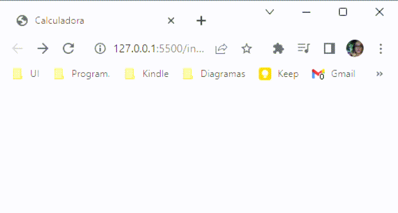

<h1 align="center">Math Operators in JS</h1>

<strong>PT-BR</strong>: Calculando com JS

 

  

 

## 🚀 Technologies 
<strong>EN:</strong> This project was developed with the following technologies:

-----
<strong>PT-BR:</strong> Esse projeto foi desenvolvido com as seguintes tecnologias:

- JavaScript
- Git e Github

 

## 📖 Project
<strong>EN:</strong> Project made in Rocketseat's course "Explorer".
Starting with the basics of JavaScript!
 
The challenge is to calculate considering the numbers put in by the user: 
- Sum; 
- Subtraction; 
- Multiplication; 
- Division; 
- Remainder; 
- If the sum is an even or odd number; 
- If the input numbers are equal. 
 

----
<strong>PT-BR:</strong> Projeto feito no curso Explorer da Rocketseat. Começando com o básico do JavaScript!
 
O desafio é, de acordo com os números inseridos pelo usuário, calcular o seguinte:
- Soma; 
- Subtração;
- Multiplicação;
- Divisão;
- Resto da divisão;
- Verificar se a soma dos dois números é par ou ímpar;
- Verificar se os dois números são iguais.
 
 
- Online project: https://lidiabrentano.github.io/math-operators-in-js/
 

-----

By Lídia Brentano 💜
